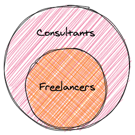
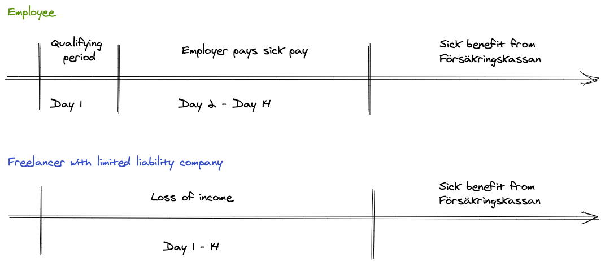

# How To Become a Freelancer in Sweden

<!-- toc -->

- [Disclaimer](#disclaimer)
- [Pull Requests Welcome!](#pull-requests-welcome)
- [Introduction](#introduction)
  * [Considerations](#considerations)
  * [What is a freelancer?](#what-is-a-freelancer)
  * [Before we start: types of businesses you can setup in Sweden](#before-we-start-types-of-businesses-you-can-setup-in-sweden)
- [Comparison: How does freelancing compare with being an employee in Sweden?](#comparison-how-does-freelancing-compare-with-being-an-employee-in-sweden)
  * [Financial risk](#financial-risk)
  * [Legal risk](#legal-risk)
  * [Growth](#growth)
  * [Compensation](#compensation)
  * [Notice period](#notice-period)
  * [Freedom](#freedom)
  * [Loneliness / Isolation](#loneliness--isolation)
  * [Alignment of Incentives](#alignment-of-incentives)
- [Checklist: What is needed to start freelancing?](#checklist-what-is-needed-to-start-freelancing)
  * [Enskild Firma (EF)](#enskild-firma-ef)
  * [Aktiebolag (AB) - Limited Company](#aktiebolag-ab---limited-company)
- [Contracts: Most important things to consider](#contracts-most-important-things-to-consider)
- [Finding work: How do you find work as a freelancer?](#finding-work-how-do-you-find-work-as-a-freelancer)
  * [Word of mouth](#word-of-mouth)
  * [Consultant brokers (Swedish: Konsultmäklare)](#consultant-brokers-swedish-konsultmaklare)
- [Banking](#banking)
- [Invoicing](#invoicing)
  * [Creating invoices manually](#creating-invoices-manually)
  * [Creating invoices with a service](#creating-invoices-with-a-service)
- [Accounting, Paperwork and Dates](#accounting-paperwork-and-dates)
  * [Taxes](#taxes)
- [Optional reading](#optional-reading)
  * [Limited Liability Companies & Dividends](#limited-liability-companies--dividends)
  * [Benefits](#benefits)
    + [Christmas gifts](#christmas-gifts)
    + [Wellness grant (Swedish: Friskvårdsbidrag)](#wellness-grant-swedish-friskvardsbidrag)
  * [Accrual fund (Swedish: Periodiseringsfond)](#accrual-fund-swedish-periodiseringsfond)
  * [Consider selling your privately owned, work-related tools to your company](#consider-selling-your-privately-owned-work-related-tools-to-your-company)
  * [Reinvesting your profits / Capital insurance (Swedish: Kapitalförsäkring)](#reinvesting-your-profits--capital-insurance-swedish-kapitalforsakring)
- [Final words](#final-words)

<!-- tocstop -->

## Disclaimer

None of the information here is meant to be neither legal nor financial advice, but rather an aggregation of information from different sources mixed in with my personal experience over the last few years. Please validate the content before you make any decisions. 😅 

## Pull Requests Welcome!

If you think that something that would be valuable for others is missing here, or if something is unclear or simply incorrect, please do open a PR! My hope is that this will be a living document that will provide value for a long time to come, and that's the main reason I decided to post this on Github, to enable others to collaborate on this.

## Introduction

For the greater part of the last couple of years, I've been freelancing both in Sweden and outside. Taking that initial step from being an employee to becoming self-employed was a daunting task, not in the least because of the sheer amount of information you need to read, discuss and process in order to get a clear view of what is actually required in terms of finding new projects, handling your accounting, taxes, finances, insurance among many other considerations.

That's why I wanted to create this page, condensing all of those learnings from the last couple of years into one canonical entry-point for anyone considering making the switch over to becoming self-employed.

If you found this guide valuable, I'd really appreciate it if you'd let me know on Twitter, 🌟 [@nabati](https://twitter.com/nabati) 🌟.

### Considerations

2. **Language.** I've written this guide in English simply because most Swedes are pretty fluent in English, and it would make it more accessible for people in general. However, this guide has been written by a Swedish citizen mainly for Swedish citizens. If you are not a Swedish citizen, there might be other considerations that you might need to take into account before venturing on this path.
3. **Links.** I've tried to find links in English for the different pages that I have linked, but in some cases there are no simple mappings between the pages, and your best bet will be to use Google Translate or a similar service to extract the information available on the page.
4. **Location.** I'm most acquainted with the freelancing situation in Stockholm and it's surroundings, so take that into account if you are planning on freelancing from some other location. Some things quoted in this text such as the hourly rates or availability of projects can likely vary somewhat depending what location you are trying to find projects in.

### What is a freelancer?

A freelancer is essentially a person who is contracted to do work via their own company for a client company. Interchangeably, you often hear people referring to freelancers as contractors or consultants, and YMMV, but most of the time they are referring to the same concept. Sometimes when people are talking about consultants, they are referring to employees of a larger consultancy agency, so they are not necessarily freelancers. So, just to hammer in the point;  while a freelancer is considered a consultant, a consultant might not be a freelancer. 

### Before we start: types of businesses you can setup in Sweden
Before jumping into everything else, I think it would be valuable to define what kind of businesses you can set up. In Sweden, there are several types of businesses you can start. For a freelancer, only two of them are commonly considered; either sole trader or a limited liability company.  

- **Sole trader, sole proprietorship**. (Swedish: Enskild näringsidkare, enskild firma, sometimes shortened EF). Essentially a license to do business as an individual. No legal entity exists for your company; you are personally liable for any business agreements you make and the company's finances are intertwined with your own. All the profits from your financial year is taxed as income. 
- **Limited liability company, limited company**. (Swedish: Aktiebolag, or shortened AB). A type of company that you can set up that is its own legal entity - your company is liable for any business decision it makes and its finances are handled separately from yours as an individual. You then become the owner and employee of the company, and your company can pay out dividends to you as the owner at a favourable taxation rate.

While it being entirely subjective, almost all of the freelancers that I know have a limited liability company. I've tried including information for both types in this guide where possible, but the extensiveness of the information shared will likely be biased towards limited liability companies. 

## Comparison: How does freelancing compare with being an employee in Sweden?

### Financial risk

As an employee, you are generally much better protected than a freelancer for a wide variety of things that increase your financial risks; 

- **Stability.** As an employee, unless you are within your trial period, the company is doing really poorly, or you've committed some really critical errors in your work, it is *very* difficult for the company to let you go in Sweden. Simply not being productive enough is seldom enough for the company to be able to let you go. As a freelancer, on the other hand, you can be let go at any time as long as it aligns with the terms in the contract.

- **Lack of opportunities.** As a freelancer, you are generally reliant on having a regular influx of projects for you to take on. Purely from a subjective point of view, over the last few years it has been very easy to find new opportunities, but as we've seen with the COVID-19 pandemic of 2020, you can never know when the next recession hits and it becomes increasingly difficult to find another project.

- **Getting sick.** Another risk factor to consider is what will happen if you get sick. If you get sick as an employee, after the first day which is a qualifying period, your employer will still compensate you for up to two weeks. After that, you can apply to Försäkringskassanto get a sick benefit, compensating you up to about 24 000 SEK per month. As a freelancer with your own limited liability company, you are considered to be an employee of your own company. That means that if you get sick, your company will pay you sick pay for two weeks, after which you can apply to Försäkringskassan like anyone else. Since you are generally working alone in your company, being sick effectively translates to a loss of income. 

  

  - [Försäkringskassan - Sickness benefit for employees](https://www.forsakringskassan.se/privatpers/sjuk/anstalld/!ut/p/z1/tZZdk5owFIZ_jZdMTj4I4TIgwoCsWuu6cOMghC27iqxQ2-2vL_amXVs_pgI3gZmT57zzkuQNitETisvkUDwnTbErk037HcV8xbyhjV0bAnB0CdIJHh1vMsaOy9AjilFcpUWGIpoTCgq4liWZ0lhGE23N15lGUiPhhtA50Y1jdVo2VfMFRemubFTZ1Gq1V3W1K-vioAZQ7YtD0lRqXw-gfvn6OoCkrJtks8nQ8pcYOPNIQPFlrctj9yuEjwzhUh3kbIopmxDfn_9V8LFJiA00VyWKWqHG2SKTo-WhUN_Qotztt63J898eQk5SzIWumaZaa0zkXDMh5RonRs5VwnOggDw47TAZLlr5njMOuBhhd3Fvh1O8w3GLB719DWYONbrFn_pDe8VPoV886RePu8W7n_EQpAkh8XyOA73fX6v36_2oG_Vi6jHPBxKKcM5AWsIhktl0CqxbvBvMKMzIaGR7BFMa9qvepR3jbU5AGq6k0-GYSHwv3r92srZZVLy8vcWyjZBjdHxv0NNtGXJ52ThCPy_9plC7fFxa0C3-RP2kZzzpF4_7xdNe8axj7ycPrN2yC8sN5mBRi_M78f61K9H_76k_7mXVdivou_b6SYQOZZF_-GE9aDcO47ydoz9vV_8e6p-055wZ/?1dmy&urile=wcm%3apath%3a%2Fcontentse_responsive%2Fprivatpers%2Fsjuk%2Fanstalld%2Fsjukpenning_for_anstallda)
  - [Försäkringskassan - Sickenss benefit for individuals with a limited company](https://www.forsakringskassan.se/privatpers/sjuk/aktiebolag/!ut/p/z1/tZZdk5owFIZ_jZdMTj4I4TIqQkHWr6orNw5itKwrskLttr--cS-2o60fU4GbkJmT57zzniQnKELPKMriQ7qOy3SXxa96Pov4nHntFnZbEIBjSpBOMHG8XhfblKEJilCUJ-kSzURsKgvwwsBLujQYWLFh8zgxlLIww1iIBY6P0UlW5uU3NEt2WamyslDzvSryXVakB9WAfJ8e4jJX-6IBxcv3TQPiTZmqxe41XqPphxy48ElA0XW102P-G4RThnCpCXLQx5T1iO-P_go4TRJiC41UhmZaqHUxyOZoekjVDzTOdvuttnn0x0VYkQRzYRq2rRYGEytu2JBwgxNrxVXMV0ABeXCeodcea_me0w246GB3_GiGc7zDscaDqX-DgUOtavHn_tBa8X2oF0_qxeNq8e5X3AZpQ0g8n-PArLe0Zr3ed6pRL_oe83wgoQhHDGRTOESyFu0DqxbvBgMKA9LptDyCKQ3rVe_SivEtTkBarqT9dpdI_Cjev3Wz6m6Uvry9RVI3kWPzeC_R831d5Pq2sX3zsvS72tr169Ii1eLP1DehEvxnXSGQjq7rhHeA974EI6hXPa4XT2vFDys2p_fE9JEdN11te5MO6aM7x7_1JPr_M3XyMsu3W0F_GpuhCB3KZv7hV_PJuHPorvQac72d_3sofgO-TO0h/?1dmy&urile=wcm%3apath%3a%2Fcontentse_responsive%2Fprivatpers%2Fsjuk%2Faktiebolag%2Fsjukpenning_for_dig_med_aktiebolag)

- **Parental leave.** Since it's Försäkringskassan that pays your parental leave benefit, there's not much difference between being regular employee versus being an employee via your own limited liability company. The only thing to look out for is that the benefit that you get paid out will be based on the salary that you've previously paid out, so if you have paid out a low or no salary for a while via your limited liability company, then you might get a lower parental leave benefit. 

  - [Verksamt - Om du är eller ska bli föräldrer](https://www.verksamt.se/driva/om-du-ar-eller-ska-bli-foralder)
  - [Försäkringskassan - Parental benefit](https://www.forsakringskassan.se/privatpers/foralder/nar_barnet_ar_fott/foraldrapenning)

Generally speaking, you can mitigate most of the financial risks simply by charging higher hourly rates and accumulating a financial buffer for times of need, as well as paying attention to specific parts of the contract that you sign with your clients, regulating for instance notice period and credit time.

### Legal risk 

If you've done something that is damaging for the company as an employee, you are generally pretty well protected against legal risk. As a freelancer, you can end up being liable. One example could be that you accidentally end up dropping some tables in the production database, which subsequently leads to an outage, which might lead to for instance 500 000 SEK loss of income for the client. Based on what your contract says regarding liability and who the client is, you can end up being liable for the client's loss of income. 

I have not yet heard of a case where a client has ended up pursuing a litigious path against a freelancer in Sweden, but I'm sure such cases exist. You can mitigate this risk by subscribing to a liability insurance policy (Swedish: Ansvarsförsäkring) for your company. Another way to mitigate this risk would be to include a liability disclaimer in the contract, and/or regulate the size of the damages that you can end up paying to the client. 

*Links*

- [If - Företag](https://www.if.se/foretag)
- [If - Ansvarsförsäkring](https://www.if.se/foretag/forsakringar/ansvarsforsakring)

### Growth

In general, your growth will likely be dependant on a number of different factors such as;
- How many (to you) novel problems you are exposed to, technical or otherwise. 
- How much space you get to explore solutions for aforementioned problems.
- What domains and industries you are exposed to while solving those problems.
- What people you get to work with, and the constellations of people that you get to work with. 

Given the above outline of factors of what create growth for an individual in general, you can't really say that either being employed or being self-employed will provide you with more growth than the other. It really depends on the organisation, situation, the people and the project and general context that you are working with. 

With that said, since freelancing by default usually is project-based and thus time-limited, you will regularly be exposed to new problems, new domains, new organisations and new people. Combined with the fact that it's much more difficult to become complacent as a freelancer (since you have a strict financial incentive to keep continuing value), that provides fairly good odds of being able to sustain growth over the longer period of time.

### Compensation

Generally speaking, there is more upside in freelancing in terms of pure compensation than there is in being employed. 

If you check the salaries for employees working at some of the largest tech companies in Stockholm, you'll find average yearly salaries of around 600 000 SEK (~ 50 000 SEK/month), give or take. Counting with taxes, social costs and other fees that the employer has to pay the government for your salary, that roughly translates to a cost for the employer of around 788 000 SEK yearly. 

Before we compare the compensation that an employee receives with the compensation a freelancer receives, let's remember that your compensation as an employee also normally includes 25 vacation days per year as well as an average of eight sick days. 

Normally, hourly rates for freelancers range between 700 to 1200 SEK. For the following calculation, let's make the assumption that the hourly rate is 1000 SEK and that you will be able to find new work continuously and without gaps, something that hasn't been much of an issue over the last couple of years. Thus, the breakdown of the compensation would be;

- Working hours in a year: 167 working hours per month * 12 months = 2004 hours
- Lost working hours: 25 vacation days * 8 sick days * 8 hours per day = 264 hours
- Total working hours: 2004 hours / year - 264 hours / year = 1740 hours / year. 
- Hourly rate: 1000 SEK / hour
- Total revenue: 1740 hours / year * 1000 SEK / hour = 1 740 000 SEK / year.   
- Other costs such as having an accounting firm, and any gear that you might need: 40 000 SEK.

All  in all, you would end up with about 1 700 000 SEK / year to pay yourself as a salary or dividends in the most optimal way. 

*Links:*

- [Ekonomifakta - Räkna ut din skatt](https://www.ekonomifakta.se/Fakta/Skatter/Rakna-pa-dina-skatter/Rakna-ut-din-skatt/#&&/wEXAQUEY2FsYwUBMYDp9Tkj4OGAN4R9N1IUN54CiLz9yKMG5G2iLHW2Pox3)
- [Glassdoor - Klarna Senior Software Engineer](https://www.glassdoor.com/Monthly-Pay/Klarna-Senior-Software-Engineer-Stockholm-Monthly-Pay-EJI_IE389854.0,6_KO7,31_IL.32,41_IM1136.htm)
- [Glassdoor - Spotify](https://www.glassdoor.com/Salary/Spotify-Software-Engineer-Stockholm-Salaries-EJI_IE408251.0,7_KO8,25_IL.26,35_IM1136.htm)

### Notice period

As a contractor, your contract determines your notice period, and it commonly ranges from no notice period, meaning that the client can terminate your contract on the same day, up to three months notice period.

Comparatively for employees in Sweden, most jobs come with a six month trial period in which there is between 0-30 days notice period. After the trial period, usually it's quite difficult for the employer to give you notice, and if it's initiated by the employee it's usually a three to six months notice period.

### Freedom

As an employee, you generally need
As an employee, you generally need to do what you are told. You always have the option of quitting, but from my experience, there has been a much higher threshold for leaving a job than for terminating a contract. Built into many contracts is also the duration of the contract, which creates a natural decision point where you need to reevaluate if you want to stick with the current project or if you want to switch to something more rewarding.

### Loneliness / Isolation

As an employee, you are more closely integrated with the company and will probably feel more attached to the other employees, and the other employees might feel closer to you because of this. In the optimal situation, you won't see much of a difference in a company whether you are freelancing or if you are an employee, but in some cases you will feel and you will be made to feel like an outsider. Also, with the transient nature of your contract, you will naturally feel less invested in the company than you would as an employee, for better and for worse.

### Alignment of Incentives

This is a more subjective point than the previous ones but; I find that freelancing is in some sense a more honest form of work than being employed, since your incentives are generally better aligned with the client's. 

As a freelancer, you get exactly what you put it. If there's overtime, you get paid for that. If the client is not happy with you, they can terminate your contract. If you are not happy with the client, you can terminate your contract. Your hourly rate will reflect the value that you can bring to the client. If you get sick, it's to no cost for the company, and it will lead to a loss of income for yourself. 

Comparing that with employment, I've seen both people that are slacking enormously or being dysfunctional without it being addressed by management, to other people working a lot of overtime without getting compensated for it, to yet other people that are not being correctly compensated simply because their starting salary at the company was low when they joined the company.

## Checklist: What is needed to start freelancing?

Essentially, you only need a couple of things to start freelancing. 
1. - [ ] Set up your company. See more under "Setting up your company". 
2. - [ ] Find a project. See more under "Finding a project".
3. - [ ] Getting a bank account for your company. See more under "Banking". 
4. - [ ] (Optional) Finding an accounting firm. See more under "Accounting". 

In Sweden, there are really two forms of companies that you can set up that are relevant for you as a freelancer, it's either Enskild Firma or Aktiebolag. In short, Enskild Firma essentially gives you as an individual a license to do business, where your personal finances are tightly intertwined with the company's finances. Aktiebolag, on the other hand, is a separate legal entity that handles its own finances and can pay you salary and dividends. See more under "Before we start: types of businesses you can setup in Sweden".

### Enskild Firma (EF)

Requirements: 
- None?

For more information on the steps, you can visit Verksamt but you essentially only have to register for F-Tax and VAT and you're good to go!

*Links:* 

-   [Verksamt - Get started - sole trader](https://www.verksamt.se/en/web/international/starting/get-started-business-registration-and-tax/sole-trader)

### Aktiebolag (AB) - Limited Company

Requirements:
- A name for the company.
- 25 000 SEK in initial capital. This initial capital is not a fee, but is kept in the company as asset. If you ever liquidate your company, you can get the 25 000 SEK back.
- One or two board members, and at least one substitute. You can be the main board member and you can ask one of your family members to be the substitute.

After that, you can follow the steps at Verksamt. Good luck!

*Links*: 

- [Verksamt - Get started - Limited company](https://www.verksamt.se/en/web/international/starting/get-started-business-registration-and-tax/limited-company)

## Contracts: Most important things to consider

There are a couple of important items to consider when signing a contract with a client. Here are some of the most common ones. Generally speaking, Sweden is not so litigious, but I find the contract in it self to be a great way of synchronising the clients and your own expectations so that there won't be any misunderstanding later on. If there's anything you can think of that you'd think would make sense to clarify beforehand, feel free to throw it into the contract.

- **Terms of credit (Swedish: Kredittid)**. Terms of credit means means how long the client has to pay the invoice once you've sent it to them. It is up to you to decide this together with the client, but it can be anywhere between 7 to 60 days. The shorter the term of credit, the lower the risk is for you. Essentially, a long term of credit can be considered a loan to the client company.
- **Notice period (Swedish: Uppsägningstid).** The notice period determines how long notice either party has to give before the contract is terminated. This is commonly anywhere between no notice period up to three months. By having a longer notice period, you can mitigate some of the risk involved with freelancing, giving you a longer period of time to look for new projects once you've been given notice. Another possibility worth mentioning is to have an asymmetric notice period, where one party has a different notice period than the other. For instance, if you as a freelancer want to end the contract the notice period might be one month, but if the client wants to terminate it, it could be two months. That would give you more freedom in switching projects if the situation is not proceeding as planned, while still mitigating any unforeseen risks in the market.
- **Non compete clauses.** Sometimes companies throw in a non-compete clause into the contract. You should be careful to sign these indiscriminately, and if you do, you should make sure that you are taking that into account when determining the compensation together with the client.
- **Liability clauses**. Usually there's a liability clause that determines the extent of your liability if something unforeseen happens as a consequence of your work. This is also a section to consider carefully. See more under the section "Legal risk".
- **Equipment.** Who will be providing the gear? This is up to you to decide with the client. Usually, if it's a larger client, they will provide you with the gear that you need, and personally I prefer that. If it's a smaller client, they will probably expect you to use your own gear.
- **Location of work.** It can be good to mention in the contract where the work should take place. Are you free to work from wherever you'd like or should all of the work happen on-site, at the client?

## Finding work: How do you find work as a freelancer?

### Word of mouth

This isn't exactly helpful for starting up as you need to get your foot in the door somewhere before being able to get some traction from word of mouth, but I've found that if you focus on doing excellent work and providing a lot of value for your clients, chances are quite high that they or someone else you are working with will recommend you to other people.

### Consultant brokers (Swedish: Konsultmäklare)

Consultant brokers are essentially middle-men that seek out potential clients, connect them with freelancers, and take a commission on the hourly rate for providing that service. From what I gather, most of them are pretty undifferentiated and provide similar services so I'd just contact a few of them and then go with whichever one you have the best chemistry with and that can provide your with the most interesting projects. Many times they all have access to the same projects. The commission they charge is usually somewhere between 7-15% of the hourly rate.

I suggest you hop on a call with a couple of them. Generally speaking, they will be more likely to find you something fitting if they have a clear idea of who you are and what kind of project you'd like to take on. Some things you might find yourself talking about with a consultant broker; 
- Who you are
- What kind of projects, technologies and industries you have worked on previously.
- What kind of projects, technologies and industries you would like to work on moving forward.
- What kind of projects and clients they usually work with. 
- What kind of hourly rate you are charging
- If you would be willing to work in places other than where you live.
 - How the process looks like once a compatible project has been found
- What their terms of payment is. Do you invoice the client and the broker invoices you, or do they invoice the client and you invoice the broker? If so, what's the credit time?
- If they offer any other services than finding you projects. 

*Links*

- [TEKSystems](https://www.teksystems.com/en)
- [DevelopersBay](https://developersbay.se/)
- [BrokerList - Long list of consultant brokers](https://brokerlist.io/)

## Banking

If you have a limited liability company, you will need to setup a separate bank account for your company. If you are a sole proprietor, it's still probably a good idea to set up a separate bank account for your company just to keep a clear record of transactions relating to your company. 

Most banks offer banking for companies. One example is SEB, which would cost you around 1200 SEK annually and includes a corporate credit card.

*Links*

- [SEB - Företagspaketet](https://seb.se/foretag/bli-foretagskund/foretagspaketet)

  

## Invoicing

When you've sold your services to your client, you need to send them an invoice. There are a couple of things you need to include on the invoice: 
- Date of sending the invoice
- Invoice number. The invoice number is an arbitrary number assigned to each invoice. Which starting number you use on your first invoice is up to you, but for the financial year, all the invoices should have increasing invoice numbers **without any gaps**. So if your first invoice for the financial year is 1000, then the second should be 1002, then 1003, etc etc.
- The sellers address and VAT-number. 
- The buyers address. If you are selling your services to a company in another EU-country, you need to specify the buyer's VAT-number as well.
- Specification of what has been sold. 
- Price. 
- What VAT-rate has been applied.
- VAT-amount
- Due date. The due date defines the credit time, or how long the buyer has to pay the invoice.  Generally speaking, the longer the credit time is, the bigger the risk you run. In my years of freelancing, I've never had an issue with this, but generally speaking, agreeing to a short credit time can be a good way of giving yourself peace of mind. If you extend the credit time, that is essentially a type of loan to your client.

If you have a limited liability company, you also need to provide; 
- The name of the company

- The company registration number.

  

### Creating invoices manually

There's nothing stopping you from creating these invoices manually. All you need to do is follow all of the rules above. Most of the items can be put into a template, but naturally, you would need to swap out customer details, the invoice number, the due date, prices and calculate the VAT-amount manually.

### Creating invoices with a service

Some services create the invoice for you and can handle for instance keeping track of if the recipient has seen the invoice, reminding the client if they haven't paid the invoice in time among other features. If you'd like help with creating your invoices, Billogram is such a service. It's priced at 10 SEK / invoice.

*Links:*

+ [Billogram](https://billogram.com/) 

## Accounting, Paperwork and Dates

Likely the biggest difference between being an employee and a freelancer is the amount of paperwork you have to deal with. Fortunately, you can outsource that work to another company if you are so inclined. While it's not a requirement, I'd strongly recommend it from my end. Ultimately, it will end up saving you a ton of time and headache, and the your accounting will likely be in better shape than if you try to MacGyver it. 

In terms of accounting and paperwork, there are a couple of things to keep track of: 
- **Current recording of transactions** (Swedish: Löpande bokföring). Essentially, all transactions need to be continuously accounted for in the books.
- **VAT-declarations**. VAT declarations are sent to Skatteverket either monthly, quarterly or annually with how much incoming and outgoing VAT you've had during the previous period. The frequency of these declarations are dependant on what you chose when you created your company. 
- **Employer declarations**. The employer declaration is sent monthly to Skatteverket with details about how much salary you have paid during the previous month. 
- **Balance sheet**. A balance sheet is a snapshot of the assets and debts in your company at a given time. At a minimum, you will need to create this at the end of the financial year to include in your annual reports.
- **Profit and loss statement**. A profit and loss statement details revenues, costs, profits and losses during a given period. At a minimum, you will need to create this at the end of the financial year to include in your annual reports.
- **Annual reports (Swedish: Årsredovisning)**..  After the financial year has been concluded, your company needs to submit an annual report to Bolagsverket. This needs to be done at the latest seven months into the new year. 

Over the last couple of years, several digital players such as Redflag or Dooer have popped up to further simplify all the accounting needs that your company might have. When I started out, none of these were significantly visible on my radar and thus I went with a traditional accounting company. However, if I had started my company today, I would probably have gone with a company similar to one of the below. 

*Links:* 

+ [Bolagsverket - Ta fram en årsredovisning](https://bolagsverket.se/ff/foretagsformer/aktiebolag/arsredovisning/ta-fram-en-arsredovisning)
+ [Redflag](https://www.redflag.se/) 
+ [Dooer](https://www.dooer.com/)

### Taxes

What kind of taxes do you need to pay? We're in Sweden so the question might be better formulated, what kind of taxes do you not need to pay??? 😅 Just kidding, taxes are cool.

#### VAT, Value Added Tax. (Swedish: Moms, Mervärdeskatt)

Shortly after declaring the VAT you need to make a payment to Skatteverket with any outstanding VAT. See more under "Accounting". 

#### **Corporate tax (Swedish: Inkomstskatt, Bolagsskatt)** 

This is what you pay on the profit that your company makes. 

When you first start your company, you will give Skatteverket an estimate of how much profit you are expecting to make. You hand this in via a preliminary income declaration (Swedish: Preliminär inkomstdeklaration). After that, you will pay a portion of the tax on a monthly basis based on that estimate. 

For subsequent years, the estimate will be based on how much profit you made during the previous years. If you expect your profits to significantly differ one year, you can always make a request to modify the estimate for that year and thus either decrease or increase the amount of taxes you need to pay during the year. 

*Links*:

- [Skatteverket - Debiterade preliminärskatt](https://www.skatteverket.se/foretagochorganisationer/skatter/skattekontobetalaochfatillbaka/debiteradpreliminarskatt/debiteradpreliminarskattnardustartarforetag.4.5c281c7015abecc2e208ee.html)
- [Skatteverket - Ändra din preliminärskatt](https://www.skatteverket.se/foretagochorganisationer/skatter/skattekontobetalaochfatillbaka/debiteradpreliminarskatt/andradindebiteradepreliminarskatt.4.5c281c7015abecc2e208d1.html)

## Optional reading

In this section I've collected some learnings that I have found relevant and useful over the years. They are not critical to get going with freelancing, but sometime in the future, they can probably be topics that are valuable to revisit.

### Limited Liability Companies & Dividends

As the owner and primary shareholder of a limited liability company, you can pay yourself dividends. These dividends, if they are below a certain threshold amount, will be favourably taxed at 20% of the amount. If you exceed the threshold amount, the excess will be taxed as income, which generally has a much higher taxation rate. 

There are two methods of determining the threshold amount. Essentially, you are free to pick the rule that is most favourable to you. 
1. **The Simplification Rule (Swedish: Förenklingsregeln).** If you use the simplification rule, you can simply pay out dividends up to a predetermined amount set by Skatteverket. For the financial year of 2019, this threshold amount was 171 875 SEK, but the amount is adjusted upwards anually. 
2. **The Main Rule (Swedish: Huvudregeln).**  The main rule is based on how much salary your company has paid out during the financial year. You can find more information in the links section below.

Additionally, one nice thing to know is that if you don't pay dividends one year, or if you only use a subset of the threshold amount, you are allowed to save the unused threshold amount for the future, and there's no limit to how long you can save up the dividend threshold amounts.

*Links:* 

+  [Skatteverket - Utdelning på kvalificerade aktier](https://www.skatteverket.se/foretagochorganisationer/drivaforetag/famansforetag/utdelningochvinstfranfamansforetag/utdelningpakvalificeradeaktier.4.b1014b415f3321c0de27ce.html)

### Benefits

#### Christmas gifts

Christmas gifts can be given to employees in a tax-free fashio, up to 450 SEK / year including VAT. A company can gift their employees with a wide number of things ranging from stocks, trips, restaurant visits or gift cards. The company can't, however, gift their employees money in a tax-free fashion. 

*Links*:

- [Skatteverket - Gåvor till anställda](https://www4.skatteverket.se/rattsligvagledning/edition/2020.6/323999.html)

#### Wellness grant (Swedish: Friskvårdsbidrag)

The company can give their employees a wellness grant up to a maximum of 5000 SEK / year. This wellness grant can be used for a number of things such as paying for a gym membership, massage, bouldering, swimming personal trainer or other activities promoting better health in the employees. Generally, however, rent or purchase of equipment is not covered by this wellness grant, under the regulation by the law. 

*Links*: 

+ [Skatteverket - Friskvårdsaktiviteter A-Ö](https://www.skatteverket.se/privat/skatter/arbeteochinkomst/formaner/personalvardmotionochfriskvard/friskvardsaktiviteterao.4.15532c7b1442f256baee714.html)

### Accrual fund (Swedish: Periodiseringsfond)

An accrual fund is an accounting practice that allows you to postpone paying taxes during a year of profits to be paid at a later date. The thought behind it is that if you are in a business where the profits fluctuate from year to year, you can even out the company's taxation from one year to another. Currently you can place a maximum of 25% of the profits into an accrual fund, postponing the taxes for that part of the profits to the future. 

Since you are postponing paying taxes, it can be seen as the government is giving you a loan on the money. Thus, you will need to account for interest on whatever the money is that you placed there. Generally the interest rates are quite low, and thus, depending on your business and the current interest rates, it would make sense to maximise the amount that you place into the accrual fund.

When you later want to withdraw money from the accrual fund (i.e. you want to pay taxes for profits that you previously postponed paying taxes for), you can do so in whatever amount you want. In other words, you don't need to pay off the same amount that you put in in one go. 

*Links*:

+ [Skatteverket - Periodiseringsfond](https://www.skatteverket.se/foretagochorganisationer/drivaforetag/aktiebolag/periodiseringsfond.4.4887341d16e1e2b8ddf30e.html)

### Consider selling your privately owned, work-related tools to your company 

If you have equipment that you will be using predominantly in your company, it's a good idea to let your company buy that equipment from you, and in the process lowering the company's profits and thus lowering the company's taxation.

In order to sell relevant equipment from yourself to your company, you need to specify the fair market value for your gear. An easy way to do that is to check for similar items, in similar condition on Blocket to see what the current value is. 

*Links*

+ [Blocket](https://www.blocket.se/)

### Reinvesting your profits / Capital insurance (Swedish: Kapitalförsäkring)

There are many ways to reinvest the profits that you accumulate in your company, but probably the easiest to access is an investment form called Kapitalförsäkring (~Capital insurance). Technically, you will subscribe to an insurance policy from a third party. In practice however, you will simply deposit money into an account which you can then freely reinvest into the stock market. 

Since you are not the owner of the account, only the subscriber of the policy, you don't need to account for the individual purchases and sales made from within the account. The taxation on the contents of the account are also favourable, where you only pay a small template-tax on deposits, withdrawals and the balance in your insurance.  

*Links:* 

+ [Avanza - Kapitalförsäkring](https://www.avanza.se/konton-lan-prislista/konton/kapitalforsakring.html)
+ [Nordnet - Kapitalförsäkring](https://www.nordnet.se/se/tjanster/konton/kapitalforsakring)

## Final words

Deciding whether you should be a freelancer or an employee is not necessarily an easy choice. It very much depends on what you want to do and what you find more valuable, and no one can make that decision for you. Furthermore, life is long, and just because you make a decision at one stage doesn't mean you have to stick with it for all eternity. There's nothing stopping you from going back and forth between freelancing and being an employee, so simply figure out what makes most sense for you at this stage and go with that. 

I hope that you found this guide useful and informative, regardless of what you decide to do moving forward. If you did, I'd be super happy if you gave me a shoutout on Twitter, [@nabati](https://twitter.com/nabati).
